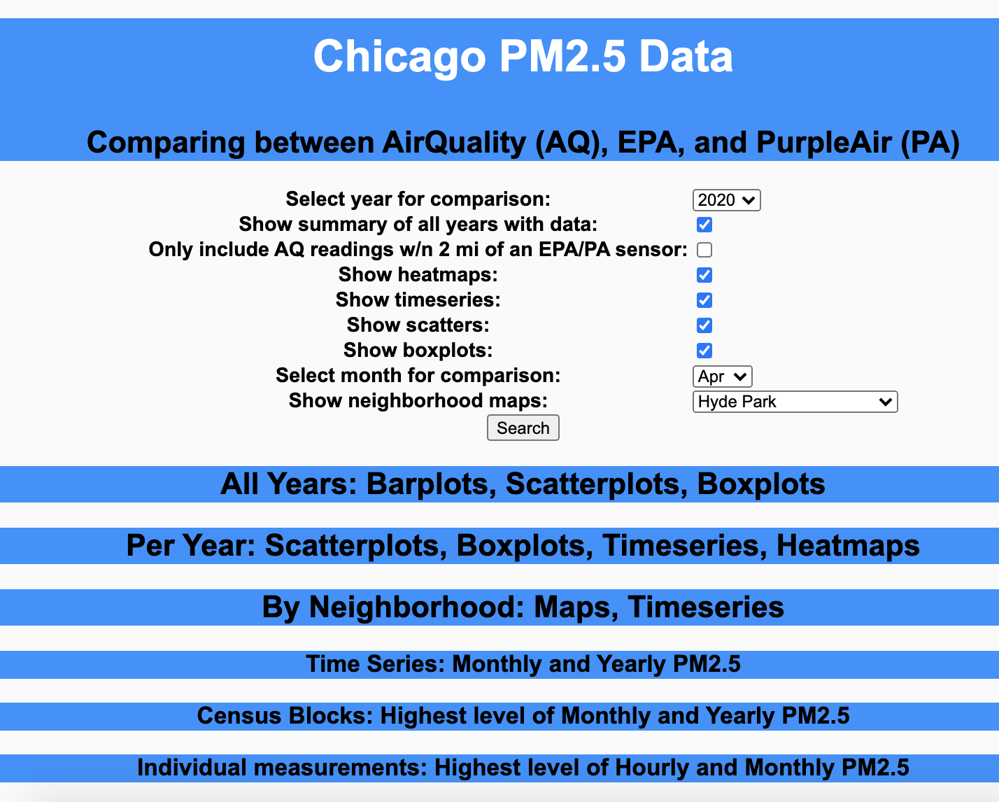

# Chicago PM2.5 Project
 
## Project Description
This [prototype tool] https://chicago-air-quality.herokuapp.com/ illustrates and compares 3 different PM 2.5 data sources, by day and neighborhood, in Chicago:

- ELPC community monitoring [data] (https://airqualitychicago.org/)
- Environmental Protection Agency public air sample [data] (https://aqs.epa.gov/aqsweb/documents/data_api.html)
- Purple Air self-reported [data] (https://www2.purpleair.com/)

Contributors: L. Dinh

See preliminary analysis results [here] (https://dtmlinh.github.io/tech-portfolio/blog/2020/11/02/blog-post)

